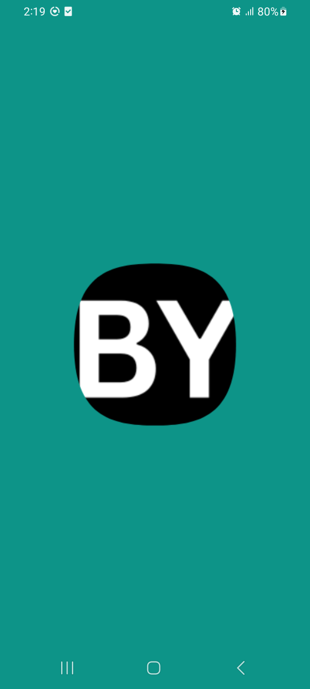
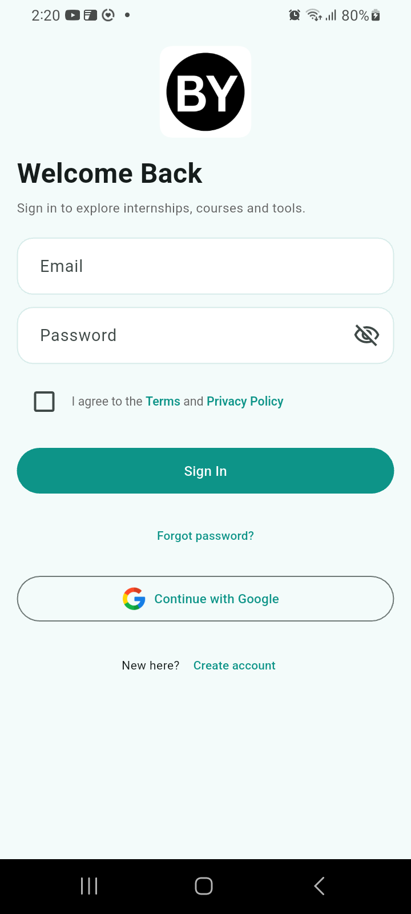
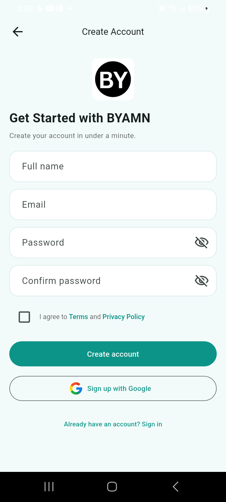
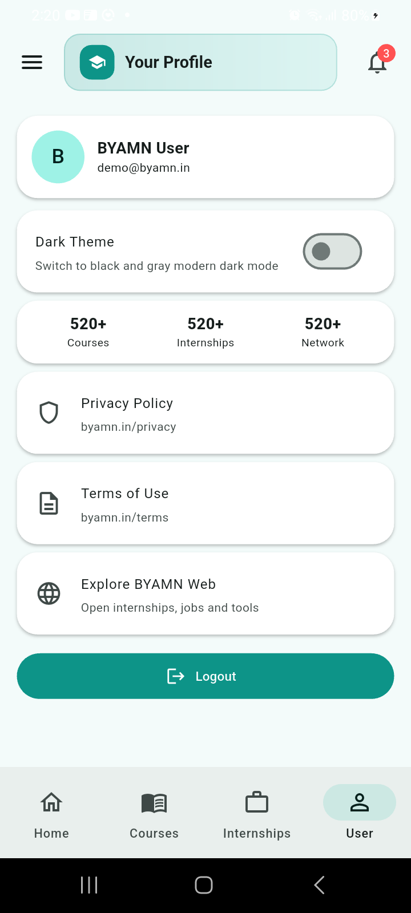
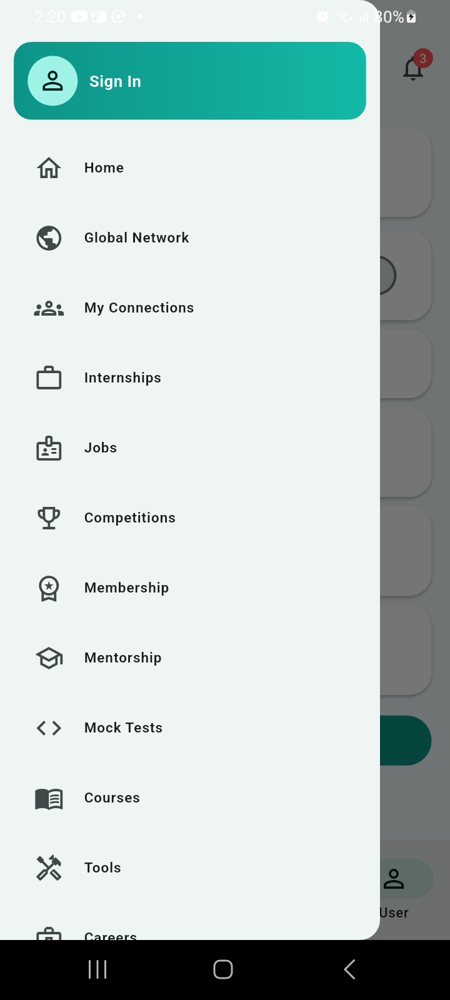
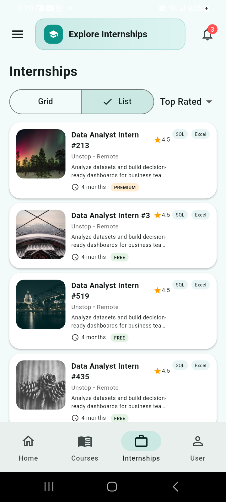
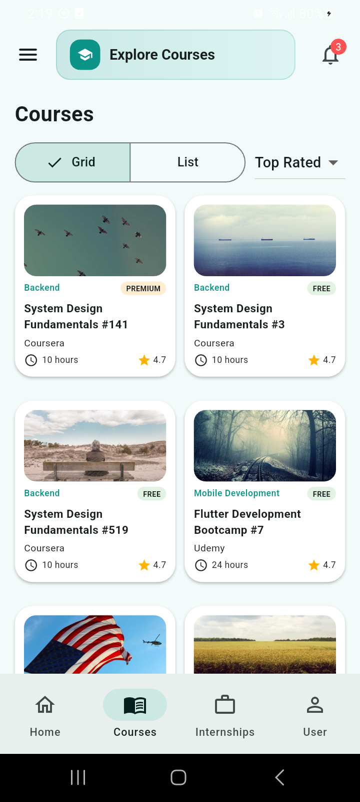
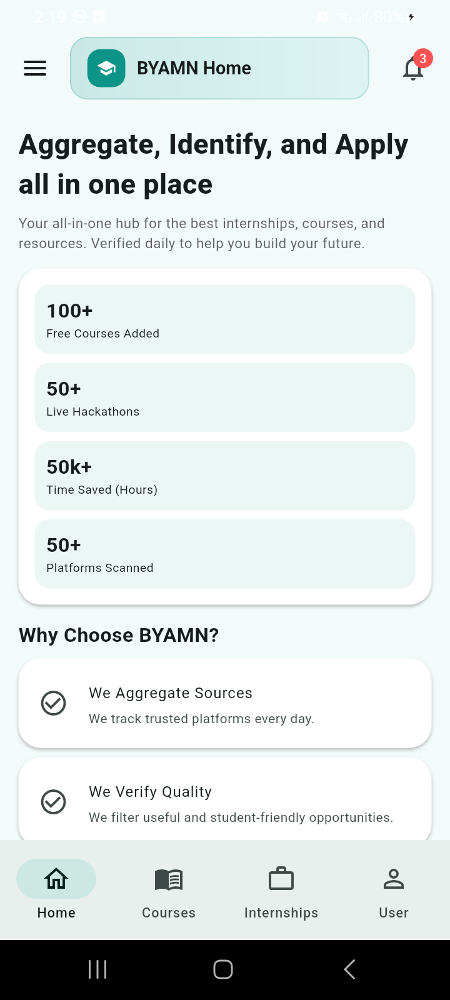
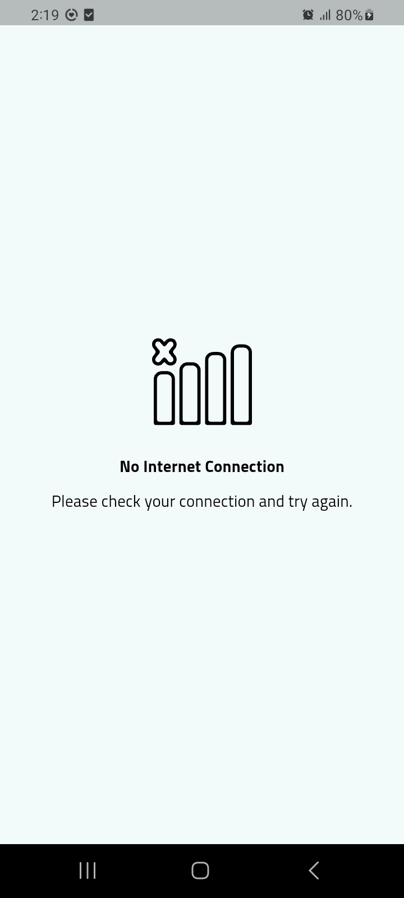

# BYAMN Flutter App

BYAMN mobile app built with Flutter using **Provider** architecture, static/demo-first screens, Firebase auth hooks, connectivity handling, and module-based UI (courses, internships, jobs, tools, network, mock tests, mentorship, membership, careers).

## Tech Stack
- Flutter (Dart)
- Provider (state management)
- Firebase (`firebase_core`, `firebase_auth`, `google_sign_in`)
- `go_router` (auth-aware routing)
- `flutter_secure_storage` (login persistence)cm
39Z- `connectivity_plus` (internet wrapper)
- `url_launcher` (privacy/terms external links)


## Screenshots

<div>









</div>

## Project Structure (Current)

```text
lib/
├── byamn_app.dart
├── main.dart
├── firebase_options.dart
├── constants/
│   ├── app_constants.dart
│   ├── assets_path.dart
│   └── router/
│       ├── app_router.dart
│       └── app_routes_list.dart
├── core/
│   ├── secure_storage/
│   └── theme/
├── data/
│   ├── repositories/
│   │   └── static_content_repository.dart
│   └── static/
│       └── byamn_static_json.dart
├── models/
│   ├── app_user.dart
│   ├── home_models.dart
│   ├── network_user.dart
│   ├── notification_item.dart
│   └── opportunity_models.dart
├── providers/
│   ├── auth_provider.dart
│   ├── auth_form_provider.dart
│   ├── connectivity_provider.dart
│   ├── content_provider.dart
│   ├── navigation_provider.dart
│   └── theme_provider.dart
├── screens/
│   ├── app/
│   ├── auth/
│   ├── courses/
│   ├── details/
│   ├── home/
│   ├── internships/
│   ├── notifications/
│   ├── profile/
│   └── no_internet_screen.dart
├── services/datasource/
└── shared/
      ├── utils/
      └── widgets/
```

## Provider Architecture

App is fully provider-driven (no `setState` for screen/business state):

- `AuthProvider`: login/signup/google auth + secure login flag
- `ContentProvider`: static datasets, sorting, pagination, FAQs, jobs/tools/network data
- `NavigationProvider`: bottom nav + loader simulation
- `ConnectivityProvider`: realtime connection status
- `ThemeProvider`: light/dark theme switching
- `AuthFormProvider`: auth form controllers/visibility/checkbox state

##  MongoDB JSON Compatibility

Shared a JSON (collections like `careers`, `courses`, `featured`, `hackathons`, `internships`, `jobs`, `mentors`, `notifications`, `practice`, `premium_resources`, `resources`, `scholarships`, `users`).

### Current app consumption status

- Already aligned and rendered in app flows:
   - `courses`
   - `internships`
   - `jobs`
   - `notifications`
   - `users` (network/community style)
   - `hackathons` / `featured` / `tools` style data represented via `competition` and `tool` sections

- Module screens already implemented as static functional UI:
   - Global Network
   - My Connections
   - Mock Tests
   - Mentorship
   - Membership
   - Tools
   - Careers

### Data adapter point

Use `lib/data/repositories/static_content_repository.dart` as the adapter layer to map incoming MongoDB JSON to app models (`OpportunityItem`, `NetworkUser`, `AppNotificationItem`, `FaqItem`).

 backend will sends exactly the schema posted, map fields as follows:
- `logo`/`image`/`photo` -> `imageUrl`
- `company`/`platform` -> `provider`
- `applyLink`/`link` -> `url`
- `participants`/`users` -> optional badges or subtitle metrics
- collection source -> `OpportunityType` (`course`, `internship`, `job`, `tool`, `competition`)

## Firebase Options (Generate / Update)

You requested generated steps for `firebase_options.dart`:

1. Install FlutterFire CLI (once):
```bash
dart pub global activate flutterfire_cli
```

2. Ensure CLI path is available in shell:
```bash
export PATH="$PATH":"$HOME/.pub-cache/bin"
```

3. Configure Firebase for this Flutter project:
```bash
cd /Users/admin/Desktop/byamn
flutterfire configure
```

4. This regenerates:
- `lib/firebase_options.dart`
- platform firebase config updates (based on selected targets)

## Run Locally

```bash
cd /Users/admin/Desktop/byamn
flutter pub get
flutter run
```

## Release APK

```bash
cd /Users/admin/Desktop/byamn
flutter build apk --release
```

APK output:
- `build/app/outputs/flutter-apk/app-release.apk`

## Notes
- `firebase_options.dart` is generated and can be re-generated any time from FlutterFire CLI.
- Static content + large demo datasets are currently generated through provider/repository  flow.
